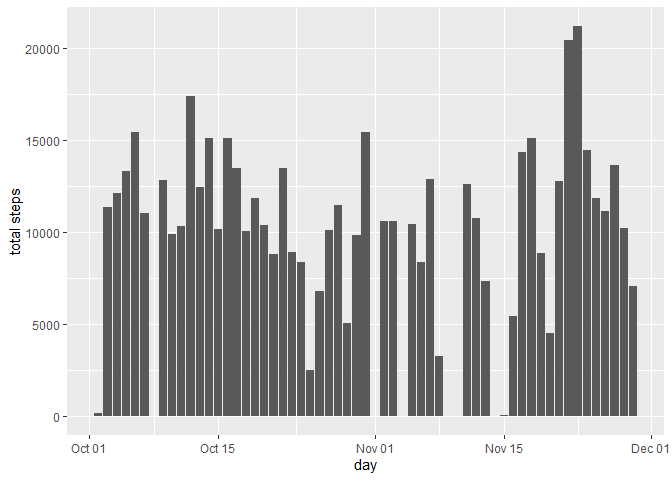
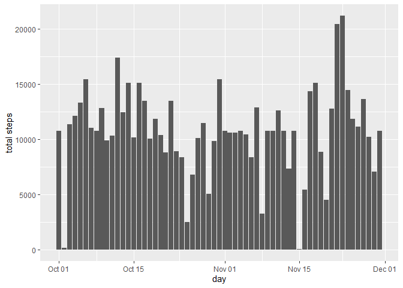
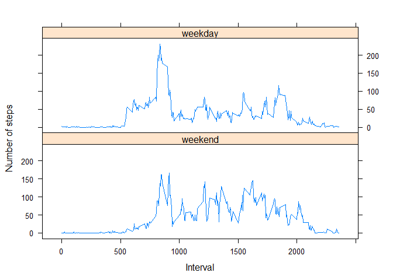

Loading and tidying data:
-------------------------

    data <- read.csv(unz("activity.zip", "activity.csv"))
    data <- transform(data, date = as.Date(date))

Mean total number of steps taken per day:
-----------------------------------------

Exclude NA:

    available_data <- data[!is.na(data[1]),]

    get_steps_per_day <- function(d) {
      steps_per_day <- tapply(d$steps, d$date, sum)
      
      
      steps_per_day <-
        data.frame(cbind(day = names(steps_per_day), steps = steps_per_day))
      
      rownames(steps_per_day) <- NULL
      
      steps_per_day <- transform(steps_per_day, day = as.Date(day))
      steps_per_day <- transform(steps_per_day, steps = as.numeric(as.character(steps)))
    }
    get_steps_per_interval <- function(d) {
      steps_per_interval <- tapply(d$steps, d$interval, mean)
      
     
      
      steps_per_interval <- 
        data.frame(cbind(interval = names(steps_per_interval), steps = steps_per_interval))
      
      rownames(steps_per_interval) <- NULL
      
      steps_per_interval <- transform(steps_per_interval, interval = as.numeric(as.character(interval)))
      steps_per_interval <- transform(steps_per_interval, steps = as.numeric(as.character(steps)))
    }

Total steps per day:

    total_steps_per_day_with_available_data <- get_steps_per_day(available_data)

Histogram of the above:

Mean and median of the above:

    mean_avaialble_steps <- mean(total_steps_per_day_with_available_data$steps)
    median_available_steps <- median(total_steps_per_day_with_available_data$steps)

The mean and median of the total steps per day are **10,766** and
**10,765**.

Average daily activity pattern?
-------------------------------

    average_steps_per_interval_with_available_data <- get_steps_per_interval(available_data)

A plot of the above:

Maximum average steps:

    is_max <-
      average_steps_per_interval_with_available_data$steps ==
        max(average_steps_per_interval_with_available_data$steps)
    max_per_interval <- average_steps_per_interval_with_available_data[is_max,]
    interval_for_max <- max_per_interval$interval

The interval with the maximum average steps is **835**.

Imputing missing values
-----------------------

Calcualte the total number of missing values in the databaset:

    total_missing_values <- sum(is.na(data$steps))

The total number of missing values is **2304**.

Fill in the missing values by using the average available steps for a
given interval and call it `filled_data`:

    filled_data <- data
    na_indices <- which(is.na(filled_data$steps))
    ave_steps <- average_steps_per_interval_with_available_data # shorten for readability
    for(i in na_indices) {
      interval <- filled_data$interval[i]
      filled_data$steps[i] <- ave_steps[ave_steps$interval ==interval,]$steps
    }

A histogram of the total steps per day with the filled in data:

Calculate the mean and medial total number of steps taken per day with
the filled in data:

    mean_filled_steps <- mean(total_steps_per_day_with_filled_data$steps)
    median_filled_steps <- median(total_steps_per_day_with_filled_data$steps)

The mean and remdian of the total steps taken per day with filled in
data are **10,766** and **10,766**, respectively. This compares to
**10,766** and **10,765** for data without missing values, which are
very close. So we conclude that filling in missing values have no
meaningful impact to the calculations

Are there differences in activity patterns between weekdays and weekends?
-------------------------------------------------------------------------

Add a weekday / weekend factor variable to the filled data to indicate
what type of day the steps were taken in:

    weekdays_list <- c("Monday", "Tuesday", "Wednesday", "Thursday", "Friday")
    filled_data$day_of_week <- weekdays(filled_data$date)
    filled_data$type_of_day <-
      factor(filled_data$day_of_week %in% weekdays_list,
             levels = c(FALSE, TRUE),
             labels = c("weekend", "weekday"))

A panel plot that compares steps taken during a weekend vs. a weekday:

